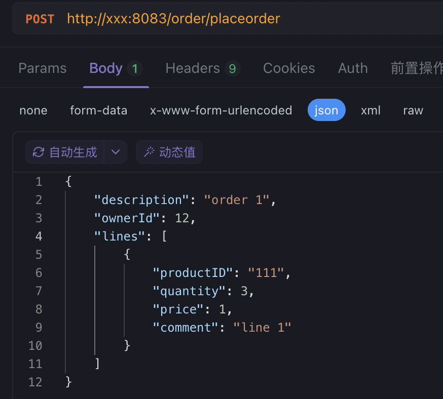

这是一个遵循DDD规范的代码库，以接口/order/placeorder为例可以查阅每层代码的实现。

代码骨架说明见DDD代码骨架说明.pdf

启动前需要根据你自己的实际情况修改conf目录下的配置文件
1、app.toml      指定服务端口
2、db.toml       指定mysql数据库地址 端口  密码等
3、redis.toml    指定redis服务地址 端口  密码等
修改完配置后把bin/ddd-demo-go 可执行文件启动即可

